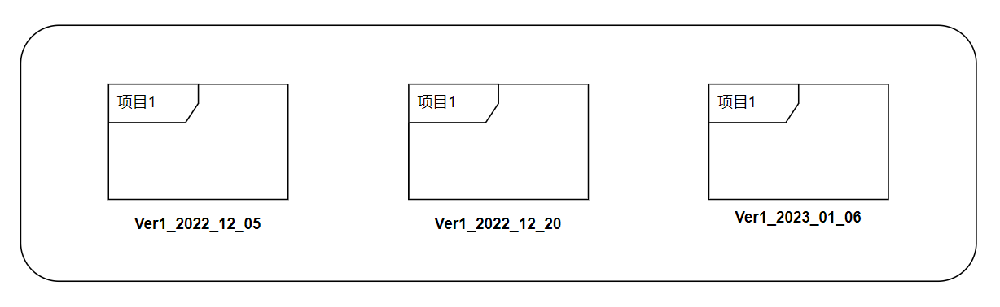
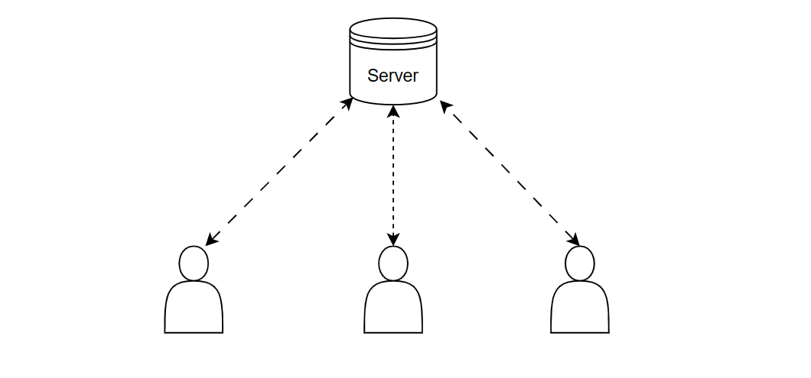
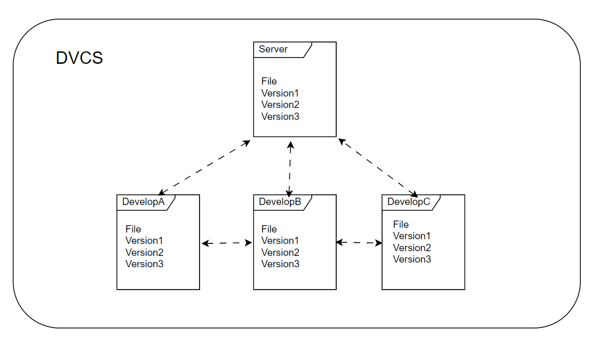
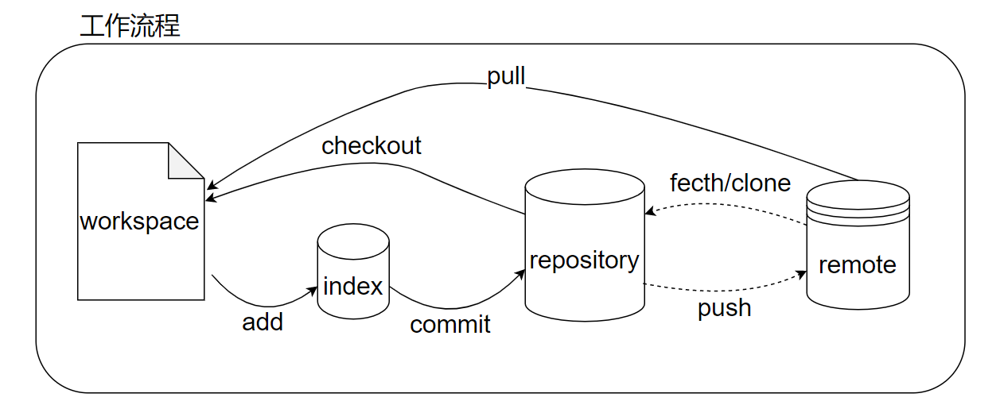
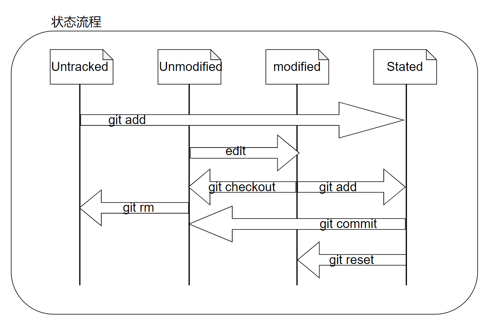

# GIT使用教程

​	本文主要参考 [git官方文档](https://git-scm.com/book/zh/v2)进行实验记录，github 项目使用测试。详情情况可以参官方文档。

## 1 关于版本控制

### 1.1 本地控制

​	本地控制系统（Local Control System）人为通过复制整个项目目录来进行版本管理，或许会添加日期和版本号加于区分各个版本的信息，这样一定程度上方便快捷，不需要花时间学习额外的应用，但是特别容易犯错 ，不可控因素太多。			

​			

### 1.2 集中控制

​	本地控制系统不具备多人协同开发的功能，集中版本控制系统（Centralized Version Control System）可以很好地解决这问题。CVCS就是有一个集成服务器来保存所有修定版本。每个开发人员，可以通过客户端进行远程拉取和提交更新操作。缺点也很明显，必须要有一个中央服务器来存储版本信息，一但没有了网络就无法进行协同工作了。



### 1.3 分布式控制

​	分布式版本控制系统（Distributed Version Control System，简称 DVCS ),  客户端并不只提取最新版本的文件快照， 而是把代码仓库完整地镜像下来，包括完整的历史记录。 这么一来，任何一处协同工作用的服务器发生故障，事后都可以用任何一个镜像出来的本地仓库恢复。 因为每一次的克隆操作，实际上都是一次对代码仓库的完整备份。



## 2 Git简介

​	git 与其他版本控制（SVN）最大的区别就是，**直接记录快照，并非保存差异**。每当你提交更新或保存项目状态时，它基本上就会对当时的全部文件创建一个快照并保存这个快照的索引。为了效率，如果文件没有修改，Git 不再重新存储该文件，而是只保留一个链接指向之前存储的文件。 Git 对待数据更像是一个 快照流。

### 2.1 基本概念

​	git 项目分三个阶段， Workspace，暂存区（index,staged），Repository。在没有远程仓库时，三大区也能独立运行。

- Workspace： 工作区，平时用于存放项目目录的地方。
- Index/staged:   暂存区，用于临时存放你的改动。
- Repository：仓库区（.git目录），所有版本的数据都存放在这。HEAD指向最新放入仓库的版本。

- Remote: 远程仓库，托管代码的服务器。

### 2.2 工作流程

​	git基本流程工作由，clone, add, commit ,push, pull , fetch 命令组成。这些命令操作文件，会让文件产生四种状态，分别为

Untracked, Unmodify, Modify, Stated。



- Untracked ：未跟踪，表示文件处于项目目录，但未受版本系统控制， 通过`git add`命令可以将其状态改为Stated。
- Unmodify： 受版本系统控制， 且和当前版本内容一致。如果被修改，则状态变为modify,可以通过命令`git rm`移出版本库变为untracked状态。

- Modify：文件已经修改，通过`git add` 命令，将其提交的暂存区，状态改为Stated,  可能通过`git checkout`命令，检出当前版本的文件将其覆盖。状态改为Unmodify。
- Stated： 暂存状态，通过`git commit`命令提交到版本库，状态改为Unmmodify,  执行`git reset HEAD filename`取消暂存, 文件状态为Modified。



## 3 Git安装与配置

- ubuntu下安装git

```bash
sudo apt install git-all
```

- 配置提交代码的用户与邮箱

```bash
$ git config --global user.name "fridy"
$ git config --global user.email fridy@outlook.com
# 可以查看配置情况
$ git config --list 			
user.email=fridy@outlook.com
user.name=fridy
```

- 生成ssh密钥

```bash
#-t 加密方式, -f  输出文件名
$ ssk-keygen -t ed25519 -f filename 
```

- 更改gitk gui 的编码方式

```bash
# gitk 和 gui 命令会打界面git,不设置会出现中文乱码。
$ git config --global gui.encoding utf-8 
```

- 配置忽略文件  

​	 如果要将一些忽略文件，移除Git版本管理文件， 可以通过配置`.gitignore`，例如将一些日志文件，编译文件移附版本管理。将

*.[oa] ,  *~  输入到.gitignore文件。

```bash
vim .gitignore
#  .o / .a 结尾的文件不纳入版本管理
*.[oa]
#  以波浪符（~）结尾的文件被忽略，编辑器（Emacs）的副本文件名一般以~结尾。
*~					    
```

​	 `.gitignore` 文件格式

- `#` 字符开关，表示注释 。
- glob通配符格式。`glob` 是一种文件匹配模式，全称 *global*，它起源于 Unix 的 bash shell。

| 通配符   | 功能                                                         |
| -------- | ------------------------------------------------------------ |
| `*`      | 匹配除了斜杠(/)之外的所有字符。 Windows上是斜杠(`/`)和反斜杠(`\`) |
| `**`     | 匹配零个或多个目录及子目录。不包含 `.` 以及 `..` 开头的。    |
| `?`      | 匹配任意单个字符。                                           |
| `[adc]`  | 匹配 `adc`中的其中一个字符。                                 |
| `[!adc]` | 匹配不在 `adc`中的任意一个字符。                             |
| `[0-9]`  | 匹配0~9的任意一个数字                                        |
| `\`      | 转义符。                                                     |
| `!`      | 排除符。                                                     |
| `+`      | 匹配一个或多个的字符串。                                     |
| `@`      | 匹配至少一个字符。                                           |
| `[...]`  | POSIX style character classes inside sequences.              |

 创建.gitignore,用于测试。

```bash
# 忽略所有.a结尾文件
*.a
# 表示前面虽然已经忽略了.a文件，！取反，表示不包lib.a
!lib.a
# 只忽略当前test1文件下文件
/test1
# 忽略任何build文件夹下的文件。
build/
# 忽略doc文件夹下的以.txt文件
doc/*.txt
# 忽略doc文件夹，包括子目录，下的所有.txt文件
doc/**/*.txt
```

- 配置`.EditorConfig`

​	EditorConfig 有助于为跨各种编辑器和 IDE 处理同一项目的多个开发人员维护一致的编码风格，在项目根目录下新建`.EditorConfig`文件。配置tabsize为4。EditorConfig 文件采用类似 INI 的文件格式。

```
$ mkdir .EditorConfig && vim .EditorConfig
```

```ini
# top-most EditorConfig file
root = true
# all files
[*]
#缩进格式为tab类型, 大小为4, 类型还可以配置为space，空格类型。
indent_style = tab		
indent_size = 4
```

 属性值

| 属性值                     | 备注                                                         |
| -------------------------- | ------------------------------------------------------------ |
| `root`                     | 表示是最顶层的配置文件，发现值为true时，才会停止查找`.editorconfig`文件 |
| `indent_style`             | tab表示制表符，space 表示 空格                               |
| `indent_size`              | 设置space类型的大小                                          |
| `tab_width`                | 设置tab类型的宽度大小，没有配置则会取ident_size的大小        |
| `end_of_line`              | 设置换行符，值为`lf,cr,crlf`                                 |
| `charset`                  | 设置编码格式，值为`latin1,utf-8,utf-8-bom,utf-16be,utf-16le` |
| `trim_trailing_whitespace` | 设置为true忽略连续空格和单个换行符                           |
| `insert_final_newline`     | 设置为true以确保文件在保存时以换行符结尾                     |

## 4 Git仓库

​	获取Git仓库的方式，主要有两个方式， （1），通过`git init` 命令本地创建， （2）， 通过 `git clone`命令远程拉取 。

### 4.1 创建本地仓库

​	通过`git init`命令生成版本库管理所需要的文件信息，该命令将创建一个名为 .git 的子目录，这个子目录含有你初始化的 Git 仓库中所有的必须文件。

```
$ mkdir Demo 
$ cd Demo 
$ git init
```

### 4.2 创建远程仓库

​	通过`git clone <url>`  命令克隆服务器上的git版本。

```bash
$ git clone git@github.com:zh0nglihua/Demo.git # 在当前目录创建一个Demo文件夹,里面包含.git版本信息
$ git clone git@github.com:zh0nglihua/Demo.git  Test # 自定义项目名字为 "Test"
```

### 4.3 关联本地仓库

​	由于本地创建的仓库，默认的分支名为master,  而github创建的远程仓库默认分支main, 所以在创建完仓库时， 需要将分支名改为同一个名字（main）。

- 创建本地 Test 项目

```bash
$ mkdir Test && cd Test
$ git init
# 强制更改分支名为main.
$ git branch -M main
# 查看当前所有分支
$ git branch -a 		
* main
```

- github新建项目Demo: git@github.com:zh0nglihua/Demo.git
- 本地与远程仓库关联

​		关联origin 与 git@github.com:zh0nglihua/Demo.git

```bash
$ git remote add origin git@github.com:zh0nglihua/Demo.git 
$ git pull origin main:main			# 拉取远程仓库, 并且合并当前main分支。
remote: Enumerating objects: 14, done.
remote: Counting objects: 100% (14/14), done.
remote: Compressing objects: 100% (7/7), done.
remote: Total 14 (delta 1), reused 12 (delta 1), pack-reused 0
Unpacking objects: 100% (14/14), 1.43 KiB | 54.00 KiB/s, done.
From github.com:zh0nglihua/Demo
 ! [rejected]        main       -> main  (non-fast-forward)
 * [new branch]      main       -> origin/main
# 如果提示 ![rejected], 说明两个版本不一致，需要进行变基操作。
$ git pull --rebase origin main
# 提交本地分支到远程分支 u -> --set-upstream
$ git push -u origin main
# 查看config文件，config文件追加了[remote "origin"]
$ cd .git && cat config				
[remote "origin"]
        url = git@github.com:zh0nglihua/Demo.git
        fetch = +refs/heads/*:refs/remotes/origin/*
```

## 5 Git命令

​		Git 基本操作命，如果想了解某个命令的详情操作，则可以通过命令 `git [commnad] --help`  ,  例如 `git status --help`, 可以查看`git status` 命令的详情操作。

### 5.1命令简介

| 命令           | 备注                                              |
| -------------- | ------------------------------------------------- |
| `git init`     | 初始化 Git本地仓库,在当前目录生成一个`.git`文件夹 |
| `git clone`    | 克隆远程服务器仓库                                |
| `git add`      | 跟踪文件，将文件添加到Index暂存区                 |
| `git commit`   | 将暂存区里提交到本地版本库                        |
| `git status`   | 查看文件状态                                      |
| `git log`      | 查看提交历史                                      |
| `git rm`       | 删除文件                                          |
| `git mv`       | 重命令文件                                        |
| `git diff`     | 文件差异比较t                                     |
| `git checkout` | 检出当前分支的文件并覆盖工作区的文件              |
| `git reset`    | 撤销操作                                          |
| `git remote`   | 查看远程仓库                                      |
| `git fetch`    | 拉取远程仓库                                      |
| `git pull`     | 取回远程主机某个分支,并与本地的指定分支合并       |
| `git push`     | 推送当前分支到远程仓库                            |
| `git tag`      | 给某个版本打上标签，相当于别名，常用于版本release |
| `git branch`   | 版本分支                                          |
|                |                                                   |

### 5.2 命令详情


## 5 Git 标签管理


## 6 Git分支管理


## 7 Git提交代码规范


## 8 Git原理


