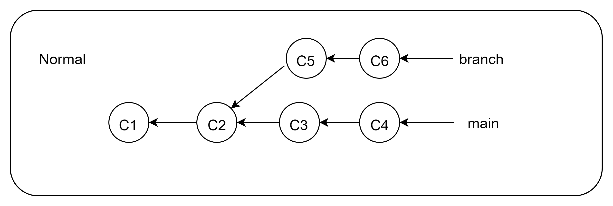
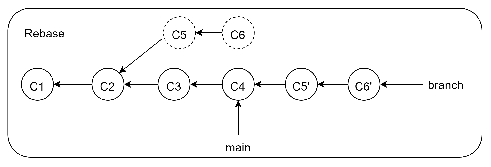

# GIT使用教程

​    本文主要参考 [git官方文档](https://git-scm.com/book/zh/v2)进行实验记录，github 项目使用测试。详情情况可以参官方文档。

## 1 关于版本控制

### 1.1 本地控制

​    本地控制系统（Local Control System）人为通过复制整个项目目录来进行版本管理，或许会添加日期和版本号加于区分各个版本的信息，这样一定程度上方便快捷，不需要花时间学习额外的应用，但是特别容易犯错 ，不可控因素太多。            

​            

### 1.2 集中控制

​    本地控制系统不具备多人协同开发的功能，集中版本控制系统（Centralized Version Control System）可以很好地解决这问题。CVCS就是有一个集成服务器来保存所有修定版本。每个开发人员，可以通过客户端进行远程拉取和提交更新操作。缺点也很明显，必须要有一个中央服务器来存储版本信息，一但没有了网络就无法进行协同工作了。


### 1.3 分布式控制

​    分布式版本控制系统（Distributed Version Control System，简称 DVCS ),  客户端并不只提取最新版本的文件快照， 而是把代码仓库完整地镜像下来，包括完整的历史记录。 这么一来，任何一处协同工作用的服务器发生故障，事后都可以用任何一个镜像出来的本地仓库恢复。 因为每一次的克隆操作，实际上都是一次对代码仓库的完整备份。


## 2 Git简介

​    git 与其他版本控制（SVN）最大的区别就是，**直接记录快照，并非保存差异**。每当你提交更新或保存项目状态时，它基本上就会对当时的全部文件创建一个快照并保存这个快照的索引。为了效率，如果文件没有修改，Git 不再重新存储该文件，而是只保留一个链接指向之前存储的文件。 Git 对待数据更像是一个 快照流。

### 2.1 基本概念

​    git 项目分三个阶段， Workspace，暂存区（index,staged），Repository。在没有远程仓库时，三大区也能独立运行。

- Workspace： 工作区，平时用于存放项目目录的地方。

- Index/staged:   暂存区，用于临时存放你的改动。

- Repository：仓库区（.git目录），所有版本的数据都存放在这。HEAD指向最新放入仓库的版本。

- Remote: 远程仓库，托管代码的服务器。

### 2.2 工作流程

​    git基本流程工作由，clone, add, commit ,push, pull , fetch 命令组成。这些命令操作文件，会让文件产生四种状态，分别为

Untracked, Unmodify, Modify, Stated。


- Untracked ：未跟踪，表示文件处于项目目录，但未受版本系统控制， 通过`git add`命令可以将其状态改为Stated。

- Unmodify： 受版本系统控制， 且和当前版本内容一致。如果被修改，则状态变为modify,可以通过命令`git rm`移出版本库变为untracked状态。

- Modify：文件已经修改，通过`git add` 命令，将其提交的暂存区，状态改为Stated,  可能通过`git checkout`命令，检出当前版本的文件将其覆盖。状态改为Unmodify。

- Stated： 暂存状态，通过`git commit`命令提交到版本库，状态改为Unmmodify,  执行`git reset HEAD filename`取消暂存, 文件状态为Modified。


## 3 Git安装与配置

- ubuntu下安装git

```bash
sudo apt install git-all
```

- 配置提交代码的用户与邮箱

```bash
$ git config --global user.name "fridy"
$ git config --global user.email fridy@outlook.com
# 可以查看配置情况
$ git config --list             
user.email=fridy@outlook.com
user.name=fridy
```

- 生成ssh密钥

```bash
#-t 加密方式, -f  输出文件名
$ ssk-keygen -t ed25519 -f filename 
```

- 更改gitk gui 的编码方式

```bash
# gitk 和 gui 命令会打界面git,不设置会出现中文乱码。
$ git config --global gui.encoding utf-8 
```

- 配置忽略文件  

​     如果要将一些忽略文件，移除Git版本管理文件， 可以通过配置`.gitignore`，例如将一些日志文件，编译文件移附版本管理。将

*.[oa] ,  *~  输入到.gitignore文件。

```bash
vim .gitignore
#  .o / .a 结尾的文件不纳入版本管理
*.[oa]
#  以波浪符（~）结尾的文件被忽略，编辑器（Emacs）的副本文件名一般以~结尾。
*~                        
```

​     `.gitignore` 文件格式

- `#` 字符开关，表示注释 。
- glob通配符格式。`glob` 是一种文件匹配模式，全称 *global*，它起源于 Unix 的 bash shell。

| 通配符      | 功能                                              |
| -------- | ----------------------------------------------- |
| `*`      | 匹配除了斜杠(/)之外的所有字符。 Windows上是斜杠(`/`)和反斜杠(`\`)     |
| `**`     | 匹配零个或多个目录及子目录。不包含 `.` 以及 `..` 开头的。              |
| `?`      | 匹配任意单个字符。                                       |
| `[adc]`  | 匹配 `adc`中的其中一个字符。                               |
| `[!adc]` | 匹配不在 `adc`中的任意一个字符。                             |
| `[0-9]`  | 匹配0~9的任意一个数字                                    |
| `\`      | 转义符。                                            |
| `!`      | 排除符。                                            |
| `+`      | 匹配一个或多个的字符串。                                    |
| `@`      | 匹配至少一个字符。                                       |
| `[...]`  | POSIX style character classes inside sequences. |

 创建.gitignore,用于测试。

```bash
# 忽略所有.a结尾文件
*.a
# 表示前面虽然已经忽略了.a文件，！取反，表示不包lib.a
!lib.a
# 只忽略当前test1文件下文件
/test1
# 忽略任何build文件夹下的文件。
build/
# 忽略doc文件夹下的以.txt文件
doc/*.txt
# 忽略doc文件夹，包括子目录，下的所有.txt文件
doc/**/*.txt
```

- 配置`.EditorConfig`

​    EditorConfig 有助于为跨各种编辑器和 IDE 处理同一项目的多个开发人员维护一致的编码风格，在项目根目录下新建`.EditorConfig`文件。配置tabsize为4。EditorConfig 文件采用类似 INI 的文件格式。

```
$ mkdir .EditorConfig && vim .EditorConfig
```

```ini
# top-most EditorConfig file
root = true
# all files
[*]
#缩进格式为tab类型, 大小为4, 类型还可以配置为space，空格类型。
indent_style = tab        
indent_size = 4
```

 属性值

| 属性值                        | 备注                                                  |
| -------------------------- | --------------------------------------------------- |
| `root`                     | 表示是最顶层的配置文件，发现值为true时，才会停止查找`.editorconfig`文件       |
| `indent_style`             | tab表示制表符，space 表示 空格                                |
| `indent_size`              | 设置space类型的大小                                        |
| `tab_width`                | 设置tab类型的宽度大小，没有配置则会取ident_size的大小                   |
| `end_of_line`              | 设置换行符，值为`lf,cr,crlf`                                |
| `charset`                  | 设置编码格式，值为`latin1,utf-8,utf-8-bom,utf-16be,utf-16le` |
| `trim_trailing_whitespace` | 设置为true忽略连续空格和单个换行符                                 |
| `insert_final_newline`     | 设置为true以确保文件在保存时以换行符结尾                              |

- 配置git show, git diff tabsize

```bash
git config --global core.pager 'less -x1,5'
```

## 4 Git仓库

​    获取Git仓库的方式，主要有两个方式， （1），通过`git init` 命令本地创建， （2）， 通过 `git clone`命令远程拉取 。

### 4.1 创建本地仓库

​    通过`git init`命令生成版本库管理所需要的文件信息，该命令将创建一个名为 .git 的子目录，这个子目录含有你初始化的 Git 仓库中所有的必须文件。

```
$ mkdir Demo
$ cd Demo 
$ git init
```

### 4.2 创建远程仓库

​    通过`git clone <url>`  命令克隆服务器上的git版本。

```bash
$ git clone git@github.com:zh0nglihua/Demo.git # 在当前目录创建一个Demo文件夹,里面包含.git版本信息
$ git clone git@github.com:zh0nglihua/Demo.git  Test # 自定义项目名字为 "Test"
```

### 4.3 关联本地仓库

​    由于本地创建的仓库，默认的分支名为master,  而github创建的远程仓库默认分支main, 所以在创建完仓库时， 需要将分支名改为同一个名字（main）。

- 创建本地 Test 项目

```bash
$ mkdir Test && cd Test
$ git init
# 强制更改分支名为main.
$ git branch -M main
# 查看当前所有分支
$ git branch -a         
* main
```

- github新建项目Demo: git@github.com:zh0nglihua/Demo.git
- <a name="anchor">本地与远程仓库关联</a>  

​        关联origin 与 git@github.com:zh0nglihua/Demo.git

```bash
$ git remote add origin git@github.com:zh0nglihua/Demo.git 
$ git pull origin main:main            # 拉取远程仓库, 并且合并当前main分支。
remote: Enumerating objects: 14, done.
remote: Counting objects: 100% (14/14), done.
remote: Compressing objects: 100% (7/7), done.
remote: Total 14 (delta 1), reused 12 (delta 1), pack-reused 0
Unpacking objects: 100% (14/14), 1.43 KiB | 54.00 KiB/s, done.
From github.com:zh0nglihua/Demo
 ! [rejected]        main       -> main  (non-fast-forward)
 * [new branch]      main       -> origin/main
# 如果提示 ![rejected], 说明两个版本不一致，需要进行变基操作。
$ git pull --rebase origin main
# 提交本地分支到远程分支 u -> --set-upstream
$ git push -u origin main
# 查看config文件，config文件追加了[remote "origin"]
$ cd .git && cat config        
[remote "origin"]
        url = git@github.com:zh0nglihua/Demo.git
        fetch = +refs/heads/*:refs/remotes/origin/*
```

## 5 Git命令

Git 基本操作命，如果想了解某个命令的详情操作，则可以通过命令 `git [commnad] --help`  ,  例如 `git status --help`, 可以查看`git status` 命令的详情操作。

### 5.1命令简介

| 命令           | 备注                                              |
| -------------- | ------------------------------------------------- |
| `git init`     | 初始化 Git本地仓库,在当前目录生成一个`.git`文件夹 |
| `git clone`    | 克隆远程服务器仓库                                |
| `git add`      | 跟踪文件，将文件添加到Index暂存区                 |
| `git commit`   | 将暂存区里提交到本地版本库                        |
| `git status`   | 查看文件状态                                      |
| `git log`      | 查看提交历史                                      |
| `git rm`       | 删除文件                                          |
| `git mv`       | 重命令文件                                        |
| `git diff`     | 文件差异比较t                                     |
| `git checkout` | 检出当前分支的文件并覆盖工作区的文件              |
| `git reset`    | 撤销操作                                          |
| `git remote`   | 查看远程仓库                                      |
| `git fetch`    | 拉取远程仓库                                      |
| `git pull`     | 取回远程主机某个分支,并与本地的指定分支合并       |
| `git push`     | 推送当前分支到远程仓库                            |
| `git tag`      | 给某个版本打上标签，相当于别名，常用于版本release |
| `git branch`   | 版本分支                                          |
| `git rebase`   | 变基                                              |

### 5.2 命令详情

####     5.2.1  git init

-   语法格式 

```bash
git init [options]
```

​	options : --bare , 初始化一个裸的git仓库，缺省，初始化一个空的仓库，裸仓库去除`.git`文件夹级别，将里面的子目录暴露出来，裸仓库适用于远程仓库，裸仓库可以直接作为服务器仓库供各开发者push、pull数据，实现数据共享和同步，不保存文件，只保存历史提交的版本信息。

#### 5.2.2  git clone

-   语法格式

```
git clone url [dir]
```

​	`url` : 远程仓库地址

​	`dir` : 可选项，克隆后的项目目录。

5.2.3 git add

-   语法格式

```
git add [options] files
```

​	`options` :  `-u` , 表示提交已经被跟踪过的文件到暂存区，而忽略untracked的新文件。`-A`,  表示 提交所有变化 。 `.`, 表示添加当前工作区除被删除以外的所有文件到暂存区。

#### 5.2.4 git commit

-   语法格式

```
git commit [options]
```

​	`optinos` : `-m` 提交版本信息指定内容注释。`-a` 提交已经跟踪过的文件，不包含untracked文件。`--amend`  追加提交，将本次的commit 提交合并的上次提交的commit_id 中。

```bash
# 暂存当前已经被跟踪过的文件并提交到版本库
git commit -am "message"  
# 追加提交
git commit -a --amend 
```

#### 5.2.5 git status

-   语法格式

```
git status [options] 
```

-   参数选项

| 参数        | 备注                           |
| ----------- | ------------------------------ |
| `-s`        | --short 表示简短显示文件状态， |
| `-b`        | 表示显示分支情况               |
| `--ignored` | 列出被忽略的文件               |
| `-u`        | 列出untracked文件              |

```bash
git status -s
M Git/git使用教程.md
?? sudir/
```

​	-s 返回格式，XY PATH1 -> PATH2, X显示索引的状态，Y表示工作树的状态, 与最近一次提交作比较。PATH1 表示最近一次提交的文件， `-> PATH2`表示索引或工作目录中文件。

​	 XY状态

| 状态 | 信息                 |
| :--- | -------------------- |
| ’ ’  | unmodified           |
| M    | modified             |
| A    | added                |
| D    | deleted              |
| R    | renamed              |
| C    | copied               |
| U    | updated but unmerged |
| ??   | untracked            |
| !!   | ignored              |

-   使命使用

```bash
# 显示精简,分支，文件名。
git status -sbu 
 ## main...origin/main [ahead 2]
 M Git/git使用教程.md
 D sudir/a.c
?? sudir/subfile.txt
```

#### 5.2.6 git log

-   语法格式

```
git log [options] files
```

-   选项参数

| 选项            | 备注                                                         |
| --------------- | ------------------------------------------------------------ |
| --oneline       | 以精简方式输出信息。                                         |
| --stat          | 输出增删改行统计。                                           |
| -p              | 输出每个 commit 具体修改的内容，输出的形式以 diff 的形式给出。 |
| --pretty        | 自定义输出的信息。                                           |
| --author        | 用来过滤 commit，限定输出给定的用户。                        |
| -n              | 限制要输出的数量。                                           |
| --after         | 输出在指定日期之后的记录。                                   |
| --before        | 输出在指定日期之前的记录。                                   |
| --grep          | 搜索提交信息,也支持正常表达式（只能搜索标签、不可搜索内容）。 |
| –branch Name    | 查看指定分支提交记录。                                       |
| –graph          | 图形方式列出提交记录。                                       |
| -p, -u, --patch | 输出差异补丁信息                                             |

-   --pretty=format 格式参数，自定义格式

| 选项 | 备注                                         |
| ---- | -------------------------------------------- |
| %H   | 提交对象（commit）的完整哈希字串。           |
| %h   | 提交对象的简短哈希字串。                     |
| %T   | 树对象（tree）的完整哈希字串。               |
| %t   | 树对象的简短哈希字串。                       |
| %P   | 父对象（parent）的完整哈希字串。             |
| %p   | 父对象的简短哈希字串。                       |
| %an  | 作者（author）的名字。                       |
| %ae  | 作者的电子邮件地址。                         |
| %ad  | 作者修订日期（可以用 -date= 选项定制格式）。 |
| %ar  | 作者修订日期，按多久以前的方式显示。         |
| %cn  | 提交者(committer)的名字。                    |
| %ce  | 提交者的电子邮件地址。                       |
| %cd  | 提交日期。                                   |
| %cr  | 提交日期，按多久以前的方式显示。             |
| %s   | 提交说明。                                   |

-   命令使用

```bash
#限定输出信息条，指定提交信息作者及限定精简输出。
$ git log -2 --author "zhonglihua" --oneline
f66e78d (HEAD -> main) update git.md
7715519 add a.c
```

```bash
#自定义格式输出
$ git log --pretty=format:"%an %ce %s" --graph -18
* zhonglihua fridy@outlook.com update git.md
* zhonglihua fridy@outlook.com add a.c
* zhonglihua fridy@outlook.com update git使用教程.md test amend property
* zhonglihua fridy@outlook.com test
* zhonglihua fridy@outlook.com test
* zhonglihua fridy@outlook.com test
* zhonglihua fridy@outlook.com add test.txt
* zhonglihua fridy@outlook.com format file
* zhonglihua fridy@outlook.com modified .editorconfig tab width
* zhonglihua fridy@outlook.com rename .EditorConfig to .editorconfig
*   zhonglihua fridy@outlook.com Merge branch 'main' of github.com:fridyss/Note
|\
| * fridy noreply@github.com update git使用教程.md
* | zhonglihua fridy@outlook.com fiexed tabsize && add .EditorConfig
* | zhonglihua fridy@outlook.com add
|/
* zhonglihua fridy@outlook.com fixed tab size
* zhonglihua fridy@outlook.com fixed tab size
* zhonglihua fridy@outlook.com modified tabsize is 4
* zhonglihua fridy@outlook.com fixed LCS.jpg
```

#### 5.2.7 git rm

-   语法格式

```
git rm [options] file
```

-   选项参数

| 参数     | 备注                               |
| -------- | ---------------------------------- |
| -r       | 递归操作                           |
| -f       | 强制删除                           |
| --cached | 从暂存区删除，但不会从本地删除文件 |

-   命令使用

```bash
# 从缓存区或者git仓库区强制删除。
$ git rm  -f sudir/d.c
# 从缓存区删除
$ git rm --cached sudir/e.c
```

#### 5.2.8 git mv

-   语法格式

```
git mv [options] files
```

#### 5.2.9 git diff

-   语法格式

```
git diff [options]
```

-   参数选项

| 参数     | 备注                     |
| -------- | ------------------------ |
| --cached | 比较暂存区与HEAD之间差异 |
| --staged | 含义和--cached一样       |
| --stat   | 以精简样式输出结果       |

-   命令使用

~~~bash
# 比较工作区与上次提交内容差异,缺省选项为HEAD
$ git diff HEAD
# 比较最近两次提交的差异, HEAD^表示HEAD上一次提交，HEAD^^表示上上次。
# HEAD~ 和 HEAD^, 则表示祖父提交，可以用HEAD~2
$ git diff HEAD HEAD^
index 2fc8aa3..a4ee2a4 100644
--- a/Git/git使用教程.md
+++ b/Git/git使用教程.md
@@ -501,9 +501,8 @@ $ git diff HEAD HEAD^

 ```

-123556
+123456
 1111111
-222222

 #### 5.2.10 git checkout

~~~

HEAD -> `a/Git/git使用教程.md`, HEAD^ ->  `b/Git/git使用教程.md`  ;  
@@ -501,8 +501,9 @@ $ git diff HEAD HEAD^ , `-`表示第一个文件，`+`表示第二个文件，`501` 表示开始行号，`8,9` 表示 ，第一个文件共8行，第二个文件共9号。所以解释出a/b文件的差异。

```
# HEAD指向的文件
123556
111111
222222
# HEAD^ 指向的文件
123456
111111
```

#### 5.2.10 git checkout

-   语法格式

```
git checkout file
```

-   命令使用

```bash
# 从git仓库区检出最新文件，并覆盖当前工作区文件。
$ git checkout Git/git使用教程.md
# 重置当前工作区所有更改
$ git checkout .
# 从远程仓库检测文件, 缺省是默认分支。
$ git checkout origin
```

#### 5.2.11 git  reset

​	`git reset` 用于撤消上次提交（git commit ），重新修改文件后再次提交。共有三个模式，--soft, --mixed, --hard。

-   语法格式

```
git reset [options] [file]
```

-   选项参数

| 参数    | 备注                                                         |
| ------- | ------------------------------------------------------------ |
| --hard  | 重置暂存区，工作区，HEAD指针指重置版本，使三个区都和重置版本一致。 |
| --mixed | deafalult, 重置暂区，工作保留，移动HEAD指针指向重置版本      |
| --soft  | 移动HEAD指针指向重置版本，重置版本差异回退到暂存区。         |

-   命令使用

```bash
# 重置版本到父版本
$ git reset --soft HEAD~
# 回滚到父版本
$ git reset --hard HEAD~
```

#### 5.2.12 git remote

​	操作远程服务器的仓库信息。

-   语法格式

```
git remote [command] [shortname] [url]
```

-   命令选项

| 命令      | 备注                       |
| --------- | -------------------------- |
| `add`     | 关联远程代码仓库           |
| `-v`      | 查看远程仓库地址信息       |
| `show`    | 查看远程仓库具体信息       |
| `rm`      | 解除远程仓库关联           |
| `rename`  | 重命名远程仓库             |
| `set-url` | 重新设置shortname与url关联 |

-   命令使用

​	变基操作部分命令，查看远程操作<a href="#anchor">命令</a>。

​		(1) git remote add && git remote rm 

```bash
$ git remote add origin git@github.com:fridyss/Note.git 
$ git remote rm origin 
# 查看origin值
$ cd .git && cat config
[core]
        repositoryformatversion = 0
        filemode = false
        bare = false
        logallrefupdates = true
        symlinks = false
        ignorecase = true
#重新关联远程仓库
$ git remote add origin git@github.com:zh0nglihua/Note.git
# 拉取远程分支, 合并main分支。
$ git pull origin main　
# 变基
$git pull --rebase origin main
#并配置分支up-stream
$ git push -u origin main
$ cat .git/config
[remote "origin"]
        url = git@github.com:zh0nglihua/Note.git
        fetch = +refs/heads/*:refs/remotes/origin/*
[branch "main"]
        remote = origin
        merge = refs/heads/main

```

​		(2) git  retmote rename 

```bash
$ git remote origin origin_new
[branch "main"]
        remote = origin_new
        merge = refs/heads/main
```

#### 5.2.13 git fetch

-   语法格式

```
git fetch [options]
```

-   参数选项

| 选项 | 备注                                                         |
| ---- | ------------------------------------------------------------ |
| `-t` | --tags Fetch all tags from the remote                        |
| `-n` | --no-tags ，缺省值，不会拉取标签信息。                       |
| `-a` | Fetch all remotes                                            |
| `-f` | --force <rbranch>:<lbranch> , remote branch 替代 local branch |
| `-p` | --prune 修剪，对其远程仓库，删除本地存在，也远程没有的。     |

-   命令使用

```bash
# 从服务器origin拉取仓库,包含所有分支信息。记录在.git/FETCH_HEAD.
$　git fetch origin
# 拉取服务器分支(remote_branch)信息。
$ git fetch origin remote_branch
# 拉取标签信息
$ git fetch origin -at  
 * [new tag]         v1.0.0     -> v1.0.0
 * [new tag]         v2.0.0     -> v2.0.0
 * [new tag]         v3.0.0     -> v3.0.0
```


#### 5.2.15 git pull

​	取回远程主机分支的更新，并与本地合并， 相当于`git fetch` 与 `git merge` 合并命令。

-   语法格式

```
git pull [options] [remote]
```

-   参数选项

| 参数     | 备注                         |
| -------- | ---------------------------- |
| `--stat` | 显示合并差异信息             |
| `-n`     | -no-stat ,表示不显示合并信息 |
| `-r`     | --rebase， 变基操作          |

-   命令使用

```bash
# 拉取服务器所有版本信息，并合并与当前分支相同分支。
git pull 
# 拉取origin/demo_branch_2 并与当前分支合并。
git pull origin demo_branch_2
# 拉取origin/demo_branch_2 并与main分支合并
git pull origin demo_branch_2:main
```

#### 5.2.16 git push

-   语法格式

```
git push <hostname> <lbranch>:<rbranch>
```

-   参数选项

| 选项       | 备注                            |
| ---------- | ------------------------------- |
| `-u`       | --set--upstream,设置分支upsteam |
| `--delete` | 删除远程仓库refs引用            |
| `--tags`   | tag 推送到远端仓库。            |

-   命令使用

```bash
#将当前分支提交到远程仓库。
git push 
#将本地demo_branch_x分支提交到远程分支demo_branch_x。
git push origin demo_branch_x
#将本地的main分支提交到远程仓库的demo_branch_x，缺省则新建分支。
git push origin main:demo_branch_x
#删除远程分支demo_branch_x, : 前面键入空格键。
git push origin   :demo_branch_x
To github.com:zh0nglihua/Demo.git
 - [deleted]         demo_branch_x
# 提交标签
git push origin --tags
```

#### 5.2.17 git tag

-   语法格式

```
git tag [options] <tagname> [<commit> | <object>] 
```

-   参数选项

| 选项 | 备注                                                         |
| ---- | ------------------------------------------------------------ |
| `-a` | --annotate 生成未签名的带注释标记对象                        |
| `-s` | --sign 生成 GPG-signed 标签, 使用默认的 e-mail address 密钥  |
| `-m` | <msg> 给出注解                                               |
| `-l` | -l <pattern>, --list <pattern>, 列出标签信息，如果pattern给出，只列出匹配标签部分 |
| `-d` | --detele 删除标签                                            |

-   命令使用

    （1） 创建&推送&删除标签

```bash
#为最新的提交创建标签
$ git tag v4 -m "verions v4" 
#推送单个标签， 
$ git push origin v4
#推送所有标签
$ git push origin --tags
#删除本地标签v4
$ git tag -d v4
#删除远程仓库分支V4
$ git push origin --delete tag v4
#指定commit id (1195c9f) 创建标签
$ git tag -a v3.0 1195c9f -m "version 3.0"
$ git log --oneline
5a965a3 (HEAD -> main, tag: v7) update a.c
0527793 (tag: v6, tag: v5, origin/main, demo_branch_xx) update a.c
1195c9f (tag: v3.0) update a.c
```

​		（2）查看标签

```bash
$ git tag -l
$ git tag -l v7
$ git show v7
tag v7
Tagger: zhonglihua <fridy@outlook.com>
Date:   Mon Jan 16 18:39:34 2023 +0800

version 7

commit 5a965a32e112fa6443330db5555d5a753ca8ff3b (tag: v7)

```

​		(3) 重命名标签

```bash
# 重命名后，需要手动删除旧的标签
git tag newTag oldTag
git tag -d oldTag 
```


#### 5.2.18 git branch

-   语法格式

```
git branch branchName [commitId]
```

-   参数选项

| 参数          | 备注                                 |
| ------------- | ------------------------------------ |
| `-a`          | --all , 列出所有分支，包含远程分支。 |
| `-r`          | --remote, 进查看远程分支。           |
| `-d`          | --delete， 删除一个分支              |
| `-D`          | 大写，表示强制性删除一个分支         |
| `-m`          | --move , 重命名分支                  |
| `--merged`    | 查看与当前分支合并过的分支           |
| `--no-merged` | 查看与当前分支没有合并过的分支       |
| `-v`          | -vv, --verbose 显示提示记录          |

-   命令使用

​		(1)	创建和查看分支

```bash
# 在当前HEAD指向的commit上创建分支
git branch branchName
# 列出所有分支
git branch -a
# 创建分支并切换
git checkout -b branchName [commitId]
```

​		（2）重命名分支

```bash
# 重命名分支
git branch -m old_branch new_branch
# 将分支推送到远程分支
git  push origin new_branch
# 删除远程分支
git push origin --delete old_branch
To github.com:zh0nglihua/Demo.git
 - [deleted]         old_branch

```

​		（3）	删除分支

```bash
# 删除分支	
git branch -d branch_name
# 删除远程分支
git push origin -d branch_name
# 删除远程分支
git push origin :branch_name
```

​		（4） 切换分支

```bash
git checkout branch_name
```

​		(5)	修剪分支

```bash
# 同步本地remotes分支记录，从这个记录中去除本地存在的分支，但远程不存在。
git fetch -p 
From github.com:zh0nglihua/Demo
 - [deleted]         (none)     -> origin/new_branch
git barnch -a
* demo_branch_xx
  main
  new_branch
  remotes/origin/demo_branch_xx
  remotes/origin/main
# 要查看设置的所有跟踪分支
 git branch -vv
  demo_branch_xx 0527793 update a.c
* main           5a4e37d [origin/main] update a.c
  new_branch     7041659 [origin/demo_branch_2: gone] update a.c

```

​		(6) 跟踪分支

```bash
# 创建分支brach1, 并设置上流（up-stream）分支关联
git checkout  --track origin/branch1
# 对已经存在的分支，配置up-stream上流关联。
git branch -u origin/branch1
```

#### 	5.2.19	git merge

-   语法格式

```
git merge [optinos]  HEAD <commit | branchname>
```

-   参数选项

| 选项 | 备注  |
| ---- | ----- |
| -m   | <msg> |

-   使用命令	

```bash
# 合并分支到当前开支
$ git merge branch2
Updating 5a4e37d..f789cea
Fast-forward
 a.c | 4 +---
 1 file changed, 1 insertion(+), 3 deletions(-)

# 合并当前分支并修改冲突
# ======= 上部为HEAD内容，下部为branch
$ git merge branch2
 Auto-merging a.c
 CONFLICT (content): Merge conflict in a.c
 Automatic merge failed; fix conflicts and then commit the result.
$ vim a.c 
 git brach
 <<<<<<< HEAD
 lllll
 2222222222
 =======
 heooo
 >>>>>>> branch2
 1111111111
$ vim a.c 
$ git commit -am "merge main with branch2"
	[main 3abd737] merge main with branch2
$ git log -4 --oneline --graph
*   3abd737 (HEAD -> main) merge main with branch2
|\
| * 758066b (branch2) update a.c
* | 33cc386 update a.c in main branch
|/
* f789cea modified hello
```

​	补充信息

```vim
a.c in main
	git branch
	lllll
	2222222222
	1111111111
a.c in branch2
    git branch
    heooo
    1111111111
```

#### 	5.2.20	git rebase

​	rebase 命令将提交到某一分支上的所有修改都移至另一分支上 ，命令将当前分支里的每个提交(commit)取消掉，并且临时保存为补丁(patch)(放到 “.git/rebase” 目录)，然后把 当前分支的差异补丁应用到目标分标，相当于当前分支的基楚commit_id变为目标分支。

​		




-   语法格式

```
git rebase [options] branch_name
```

-   参数选项

| 选项 | 备注                |
| ---- | ------------------- |
| `-m` | --merge 合并        |
| `-f` | --force-rebase 强制 |

-   命令使用

```bash
# 创建分支rebase_branch，并换
git checkout -b rebase_branch 
git rebase main
# 修改冲突
git rebase --continue
git log --oneline --graph
* a3bbdfe (HEAD -> main, rebase_branch) update a.c in main branch
*   3abd737 merge main with branch2
|\
| * 758066b (branch2) update a.c
* | 33cc386 update a.c in main branch
|/
* f789cea modified hello
* 140e945 (origin/branch2) update a.c
```

## 6 Git 工具

### 6.1 git show

​	 git show 操作的对象为object (blobs，树，标签和提交), 对于提交，它显示日志消息和文本差异。

-   语法格式

```
git show [options] <object>
```

-   命令使用

```bash
# 显示commit id情况
$ git show 3abd737
commit 3abd73787356e6c1e8d90c0937c6a63542bc4c78
Merge: 33cc386 758066b
Author: zhonglihua <fridy@outlook.com>
Date:   Tue Jan 17 00:16:23 2023 +0800

    merge main with branch2

diff --cc a.c
index 751dd95,63059fe..64d9885
--- a/a.c
+++ b/a.c
@@@ -1,4 -1,3 +1,5 @@@
  git branch
 +lllll
 +2222222222
+ heooo
  1111111111
```

```bash
# 显示提交里的某个文件差异
git show 3abd737 b.c
# 显示分支信息
git shwo branch
```

### 6.2git reflog

​	查看所有分支的提交记录，同时也包含被删除的记录，可用于恢复提交。

-   语法格式

```
git reflog <subcommand> <options>
```

-   命令使用

```bash
# 查看所有分支提交记录
git reflog
# 查看某个分支的提交记录
git reflog branch2
342dc20 (HEAD -> branch2) branch2@{0}: commit: update a.c
758066b branch2@{1}: commit: update a.c
f789cea branch2@{2}: commit: modified hello
140e945 (origin/branch2) branch2@{3}: commit: update a.c
5a4e37d (tag: v8, origin/branch1, branch1) branch2@{4}: branch: Created from 5a4e37d
```

### 6.3 git stash

​	  暂存当前工作文件，但不添加到index区。

-   语法格式

```
git stash <subcommand> [options]
```

-   命令使用

```bash
# 将当前的工作区缓存起来
$ git stash
Saved working directory and index state WIP on main: a3bbdfe update a.c in main branch
$ git stash list
stash@{0}: WIP on main: d669fcd update
stash@{1}: WIP on main: a3bbdfe update a.c in main branch
# 弹出最后一次（d669fcd）缓存 
$ git stash pop
$ git stash list
stash@{0}: WIP on main: a3bbdfe update a.c in main branch
# 弹出指定 stash@{1}
$ git stash pop stash@{1}
# 清除缓存 
$ git stash clear
# 丢掉最后一次缓存
git stash drop
```

### 6.4 git clean

​	删除当前工作区没有被跟踪过（untracked）的文件。

-   语法命令

```bash
git clean [options]
```

-   选项参数

| 参数 | 备注                                                         |
| ---- | ------------------------------------------------------------ |
| `-n` | -dry-run 删除演练，不会实际进行操作                          |
| `-d` | --delete 删除                                                |
| `-f` | --force 强制，不会删除 .gitignore 文件里面指定的文件夹和文件， 不管这些文件有没有被 track 过 |
| `-x` | .gitignore  里忽略的文件，如果 没有untracked，也会进行删除。 |
| -`X` | 只处理.gitignnore里的文件。                                  |

-   使用命令

```bash
$ git clean -n
Would remove f.c
Would remove h.c

$ git clean -d
Removing f.c
Removing h.c
```

## 7 Git提交代码规范
