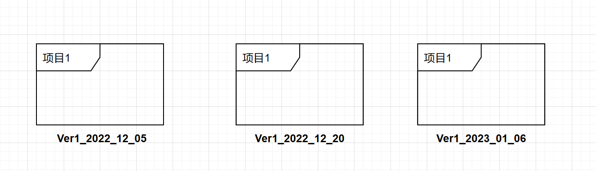

# GIT使用教程

​	本文主要参考 [git官方文档](https://git-scm.com/book/zh/v2)进行实验记录，github 项目使用测试。情况可以参官方文档。

## 1 关于版本控制

### 1.1 本地控制

​		人为通过复制整个项目目录来进行版本管理，或许会添加日期和版本号加于区分各个版本的信息，这样一定程度上方便快捷，不需要花时间学习额外的应用，但是特别容易犯错 ，不可控因素太多。

​			 

### 1.2 集中控制

### 1.3 分布式控制

### 1.4 git安装与配置

