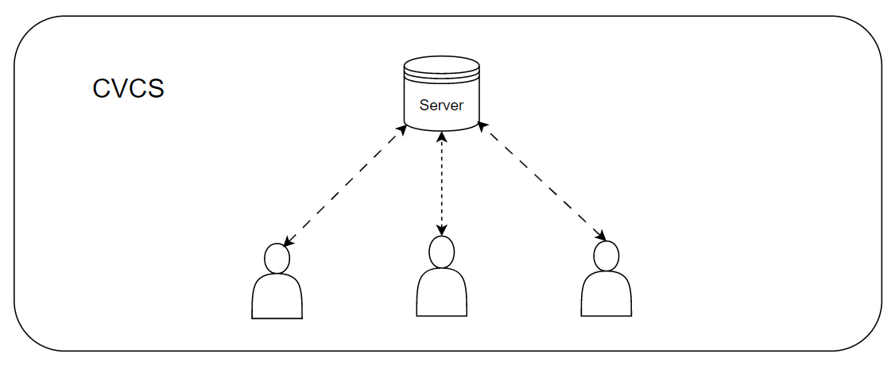

# GIT使用教程

​	本文主要参考 [git官方文档](https://git-scm.com/book/zh/v2)进行实验记录，github 项目使用测试。详情情况可以参官方文档。

## 1 关于版本控制

### 1.1 本地控制

​		本地控制系统（Local Control System）人为通过复制整个项目目录来进行版本管理，或许会添加日期和版本号加于区分各个版本的信息，这样一定程度上方便快捷，不需要花时间学习额外的应用，但是特别容易犯错 ，不可控因素太多。			 

### 1.2 集中控制

​		本地控制系统不具备多人协同开发的功能，集中版本控制系统（Centralized Version Control System）可以很好地解决这问题。CVCS就是有一个集成服务器来保存所有修定版本。每个开发人员，可以通过客户端进行远程拉取和提交更新操作。缺点也很明显，必须要有一个中央服务器来存储版本信息，一但没有了网络就无法进行协同工作了。

### 1.3 分布式控制

​	分布式版本控制系统（Distributed Version Control System，简称 DVCS ),  客户端并不只提取最新版本的文件快照， 而是把代码仓库完整地镜像下来，包括完整的历史记录。 这么一来，任何一处协同工作用的服务器发生故障，事后都可以用任何一个镜像出来的本地仓库恢复。 因为每一次的克隆操作，实际上都是一次对代码仓库的完整备份。

## 2 Git简介

​	git 与其他版本控制（SVN）最大的区别就是，**直接记录快照，并非保存差异**。每当你提交更新或保存项目状态时，它基本上就会对当时的全部文件创建一个快照并保存这个快照的索引。为了效率，如果文件没有修改，Git 不再重新存储该文件，而是只保留一个链接指向之前存储的文件。 Git 对待数据更像是一个 快照流。

### 2.1 基本概念

​	git 项目分三个阶段， 工作区，暂存区，git仓库区。

### 2.1 git安装与配置

