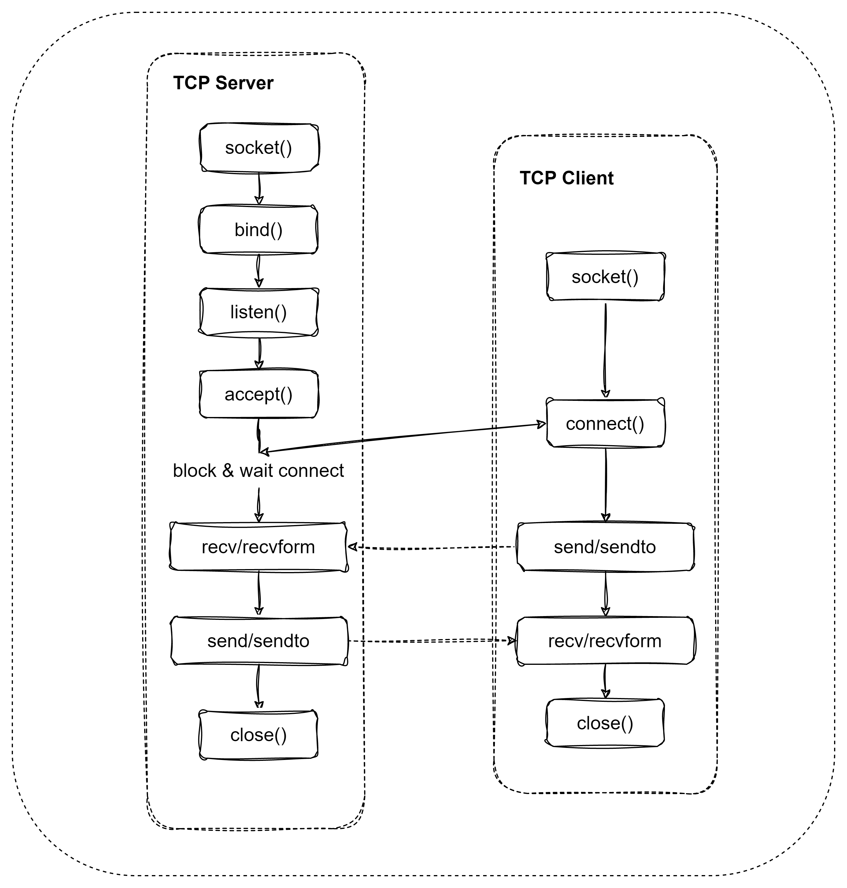

# 进程间通信机制

进程间的通信（IPC），有消息（队列/邮箱），管道，信号量（计数信号量，二值信号量），共享内存，Socket。

## 1. 消息

### 1.1  消息队列

​	消息队列提供进程间发送数据块的方法，数据块可以是用户自定义的数据类型，每个数据块大小（MSGMAX）及消息队列总字节数大小（MSGMNB），消息队列数目（MSGMNI ）受系统约束。

​	查看宏定义方式

```shell
cat /proc/sys/kernel/msgmax 最大消息长度 限制
cat /proc/sys/kernel/msgmnb 消息队列总的字节数
cat /proc/sys/kernel/msgmni 消息条目数
```

```c
#include <sys/msg.h>
int msgctl(int msqid, int cmd, struct msqid_ds *buf);
int msgget(key_t key, int msgflg);
int msgrcv(int msqid, void *msg_ptr, size_t msg_gz, long int msgtype, int msgflg);
int msgsnd(int msqid, const void *msg_ptr, size_t msg_sz, int msgflg);
```

-   `msgget()` 函数被用来创建新的消息队列或获取已有的消息队列 , 程序必须提供一个键值来命名某个特定的消息队列，进程间通过key来获取`msqid`,进行消息收发，`msgflg` 标记如下IPC_CREAT,IPC_EXCL,IPC_NOWAIT, 必须和权限标志(`rwx`)按位或才能创建一个新的消息队列。成功返回一个非负整数，即该消息队列的标识码(`msqid`)；失败返回-1.

```c
#include <bits/ipc.h>
/* Mode bits for `msgget', `semget', and `shmget'.  */
#define IPC_CREAT	01000		/* Create key if key does not exist. */
#define IPC_EXCL	02000		/* Fail if key exists.  */
#define IPC_NOWAIT	04000		/* Return error on wait.  */
```

-   `msgsnd()` 消息数据添加到消息队列中。`msqid`: 由`msgget()`函数返回的消息队列标识码, `msg_ptr`:指针指向准备发送的消息, `msg_sz`:是`msg_ptr`指向的消息长度,  `msgflg` ：IPC_NOWAIT，队列没有可读消息不等待，返回ENOMSG错误，SG_NOERROR，消息大小超过`msgsz`时被截断。

```c
//msg_ptr 指向数据类型，它必须以一个long int长整数开始，接收者函数将利用这个长整数确定消息的类型
struct msgbuf {
	long  msgtype;
	char mtext[100];
}
```

-   `msgrcv()` 从消息队列接收消息。`msgid` ， `msg_ptr`，`msg_gz`， `msgflg` 参数同`msgsnd()`。 `msgtype`: 0 返回消息队列第一个数据块，>0, 返回等于`msgtype`第一个数据块。返回队列第一条类型小于等于`msgtype`绝对值的消息，并且是满足条件的消息类型最小的消息。
-   `msgctl()` 消息队列的控制函数, `cmd`:是将要采取的动作,（有三个可取值）

```c
#include <sys/msg.h>
/* Control commands for `msgctl', `semctl', and `shmctl'.  */
#define IPC_RMID	0		/* Remove identifier.  */
#define IPC_SET		1		/* Set `ipc_perm' options.  */
#define IPC_STAT	2		/* Get `ipc_perm' options.  */
```

-   应用例程

    `ipc_sender.c`

```c
#include <stdlib.h>
#include <stdio.h>
#include <string.h>
#include <errno.h>
#include <unistd.h>
#include <sys/msg.h>
#include <string.h>

struct msg{
    long msgtype;
    char text[128];
};

int main(int argc, char *argv[])
{
    int msgid;
    struct msg test_msg;
    printf("Sender\r\n");
    msgid = msgget((key_t)1234, 0666 | IPC_CREAT);
    if(msgid == -1)
    {
        fprintf(stderr, "msgget error: %d\n", errno);
        return -1;
    }
    
    test_msg.msgtype = 1;
    memset(test_msg.text, 0 , sizeof(test_msg.text) );
    memcpy( test_msg.text, "hello msg!", strlen("hello msg!"));
    if(msgsnd( msgid, (void *)&test_msg, 128, 0) == -1)
    {
        fprintf(stderr, "msgsnd failed\n");
        return -1;
    }
   
    return 0;
}
```

​	`ipc_rev.c`

```c

#include <stdlib.h>
#include <stdio.h>
#include <string.h>
#include <errno.h>
#include <unistd.h>
#include <sys/msg.h>

struct msg{
    long msgtype;
    char text[128];
};

int main(int argc, char *argv[])
{
    int msgid;
    struct msg test_msg;
    printf("Recer\r\n");
    msgid = msgget((key_t)1234, 0666 | IPC_CREAT);
    if(msgid == -1)
    {
        fprintf(stderr, "msgget error: %d\n", errno);
        return -1;
    }
    test_msg.msgtype = 1;
    if(msgrcv(msgid, (void *)&test_msg, 128, 0, 0 ) == -1)
    {
        fprintf(stderr, "msgrcv error: %d\n", errno);
        return 0;
    }
    printf("Rev: %s", test_msg.text);
    if(msgctl(msgid, IPC_RMID, 0) == -1)
    {
        return -1;
    }
    return 0;
}
```


### 1.2 消息邮箱

​	邮箱是一种简单的线程间消息传递的方式，其特点是开销较低，效率较高。邮箱中的每一封邮件可以容纳固定大小的内容（针对 32 位处理器，可容纳 **4** 字节内容，所以一封邮件恰好可以容纳一个指针）。

## 2. 信号量

​	信号量用于管理对资源的访问，当多进程或者多线程访问共享数据时，会出现资源竟争问题，为了解决这个问题，我们可以通过对临界区访问进行同步操作。其中解决资源竟争问题方法 `原子命令操作`，`自旋锁`， `读写锁`， `信号量`， `互斥锁`， `关闭总中断`。其中信号量又可以分为计数信号量，二进制信号量。

​	如果不对共享资源并发访问进行限制，由于芯片每次指令都经历`取指，解码，执行`三个阶段。当操作共享数据时，多任务或者多进程就会有可能对数据进行了重复操作，命令运行的结果也会出错。

### 2.1  计数信号量

​	信号量 是个整型变量，当初始数值大小1时，我们称为计数信号量，它除了初始化外只能通过两个标准原子操作：wait () 和 signal() ，也就是我们常说的PV操作。

```
wait() 最初称为 P（荷兰语proberen，测试）
signal() 最初称为 V（荷兰语verhogen，增加）

P(S): 如果S的值大于零，就-1；如果它的值等于零，就挂起该进程。
V(S): 如果有其它进程因为等待 S 而被挂起，就让它恢复运行，如果没有进程因等待 S 而被挂起，就+1。
```

### 2.2 二进制信号量

当数值为1或0时，称为二进制信号量。二进制信号量与互斥锁的区别，互斥锁解决了优先级翻转的问题。

### 2.3 linux 信号机制

​	Linux 信号量函数都是针对成组的通用信号量进行操作，而不是只针对一个二进制信号量。

```c
#include <semaphore.h>
/**
	sem : 指向信号量结构的一个指针
	pshared : 0, 信号量不在进程间共享，只能在线程间共享
	value ： 信号量初始值
*/
int sem_init(sem_t *sem, int pshared, unsigned int value);
int sem_wait(sem_t *sem);
int sem_post(sem_t *sem);
```

-   多线程访问共享数据，没有进行临界区保护时.

```c
// ipc_sem.c
#include <stdio.h>
#include <pthread.h>
#include <stdlib.h>

volatile int cnt = 0; 

void* thread_sem(void* arg)
{
  for(int i = 0; i < 100000; ++i)
  {
    cnt++;
  }
  return NULL;
}

int main(int argc, char* argv[])
{
  pthread_t tid1, tid2;  
 
  pthread_create(&tid1, NULL, thread_sem, NULL);
  pthread_create(&tid2, NULL, thread_sem, NULL);
  pthread_join(tid1, NULL);
  pthread_join(tid2, NULL);
  printf("cnt = %d\n", cnt);
  return 0;
}
```

```bash
$ gcc ipc_sem.c ipc_sem.c -o ipc_sem -lpthread 
$ ./ipc_sem 
cnt = 134502	
```

​	运行`ipc_sem`后，`cnt` 并不是我们希望200000数值。

-   增加临界保护区

```c
#include <stdio.h>
#include <pthread.h>
#include <stdlib.h>
#include <semaphore.h>

volatile int cnt = 0; 
sem_t metux;

void* thread_sem(void* arg)
{
  for(int i = 0; i < 100000; ++i)
  {
    sem_wait(&metux);
    cnt++;
    sem_post(&metux);
  }
  return NULL;
}

int main(int argc, char* argv[])
{
  pthread_t tid1, tid2;  
  sem_init(&metux, 0, 1);
  pthread_create(&tid1, NULL, thread_sem, NULL);
  pthread_create(&tid2, NULL, thread_sem, NULL);
  pthread_join(tid1, NULL);
  pthread_join(tid2, NULL);
  printf("cnt = %d\n", cnt);

  return 0;
}
```

```bash
$ gcc ipc_sem.c ipc_sem.c -o ipc_sem -lpthread 
$ ./ipc_sem 
cnt = 20000000    
```

-   生产者与消费者

    生产者与消费者主要是通过缓存队列来进行通信，这样生产者与消费者解耦，为了解决队列竟争问题，需要一个互斥量来保证读写队列的排它性。还需要两个信号量来同步`可生产数`，`可消费数`。

```c
#include <stdio.h>
#include <pthread.h>
#include <stdlib.h>
#include <semaphore.h>
#include <time.h>

/*product & consumer model */
typedef struct _pcm
{
    int * buf;
    int size;
    int front;      // first item
    int rear;       // rear item
    sem_t sem_mutex;
    sem_t sem_slots;
    sem_t sem_items;
}pcm_t;

int pcm_init( pcm_t *pcm , int size)
{
    pcm->buf = (int*)calloc(size, sizeof(int));
    pcm->size = size;
    pcm->front = pcm->rear = 0;
    sem_init(&pcm->sem_mutex, 0, 1);
    sem_init(&pcm->sem_slots, 0, size);
    sem_init(&pcm->sem_items, 0, 0);

    return 0;
}


void pcm_deinit(pcm_t *sp)
{
  printf("%s\r\n", __func__);
  free(sp->buf);
}

int pcm_push(pcm_t *pcm, int data)
{
    if(pcm == NULL)
    {
         return -1;
    }
    sem_wait(&pcm->sem_slots);
    sem_wait(&pcm->sem_mutex);
    printf("producer: %d, ", data);
    pcm->buf[pcm->rear++%pcm->size] = data;
    printf("queue [%d : %d], front :%d, rear :%d \r\n", \
            pcm->sem_slots.__align, pcm->sem_items.__align+1, pcm->front%pcm->size, pcm->rear%pcm->size );
    sem_post(&pcm->sem_mutex);
    sem_post(&pcm->sem_items);
    return 0;
}

int pcm_pop(pcm_t *pcm, int* data)
{
   
    if(pcm == NULL)
        return -1;

    sem_wait(&pcm->sem_items);
    sem_wait(&pcm->sem_mutex);
    *data = pcm->buf[(pcm->front++)%pcm->size] ;
    printf("consumer: %d, ",*data);
    printf("queue [%d : %d], front :%d, rear :%d \r\n", \
            pcm->sem_slots.__align+1, pcm->sem_items.__align, pcm->front%pcm->size, pcm->rear%pcm->size );
    sem_post(&pcm->sem_mutex);
    sem_post(&pcm->sem_slots);
    return 0;
}
void *producer(void* arg)
{
    int data = 0;
    pcm_t *pcm = (pcm_t*)arg ;
    while(1)
    {
        sleep(1); 
        pcm_push(pcm, data++);
    }
}

void *consumer1(void* arg)
{
    int data;
    pcm_t* pcm = (pcm_t*)arg;
    while(1)
    {
        sleep(2);
        if(pcm_pop( pcm, &data) == 0)
        {
            printf("consumer1\r\n");
        }   
    }

    return NULL;
}

void *consumer2(void* arg)
{
    int data;
    pcm_t* pcm = (pcm_t*)arg;
    while(1)
    {
        sleep(3);
        if(pcm_pop(pcm, &data) == 0)
        {
            printf("consumer2\r\n");
        }  
    }

  return NULL;
}

int main()
{ 
  pthread_t tid1, tid2, tid3;
  pcm_t pcm;
  
  srand(time(NULL));
  pcm_init(&pcm, 5);
  
  pthread_create(&tid1, NULL, producer, &pcm);
  pthread_create(&tid2, NULL, consumer1, &pcm);
  pthread_create(&tid3, NULL, consumer2, &pcm);
  pthread_join(tid1, NULL);
  pthread_join(tid2, NULL);
  pthread_join(tid3, NULL);

  pcm_deinit(&pcm);

  return 0;
}

```

```bash
$ gcc ipc_pcm.c -o ipc_pcm -lpthread
$ ./ipc_pcm
producer: 0, queue [4 : 1], front :0, rear :1 
consumer: 0, queue [5 : 0], front :1, rear :1 
consumer1
producer: 1, queue [4 : 1], front :1, rear :2 
consumer: 1, queue [5 : 0], front :2, rear :2 
consumer2
producer: 2, queue [4 : 1], front :2, rear :3 
consumer: 2, queue [5 : 0], front :3, rear :3 
```


## 3. 共享内存

共享内存为在多个进程之间共享和传递数据提供了一种有效的方式，由于它并未提供同步机制，所以我们通常需要用其他的机制来同步对共享内存的访问。我们一般使用共享内存来提供对大块内存区域的有效访问，同时通过传递小消息来同步对该内存的访问。

```c
#include <sys/shm.h>
void *shmat(int shm_id, const void *shm_addr, int shmflg);
int shmctl(int shm_id, int cmd, struct shmid_ds *buf);
int shmdt(const void *shm_addr);
int shmget(key_t ket, size_t size, int shmflg);
```

-   `shmget()` 函数创建/获取共享内存标识`shm_id`,参数与`msqget()` 用法类似。
-   `shmat()` 第一次创建共享内存段时，它不能被任何进程访问。要想启用对该共享内存的访问，必须将其连接到第一个进程的地址空间中.
-   `shmdt()` 函数的作用是将共享内存从当前进程中分离，它的参数是`shmat`返回的地址指针，成功时返回 0，失败时返回-1。注意，将共享内存分离并未删除它，只是使得该共享内存对当前进程不再可用

## 4.管道

### 4.1 无名管道

   只能用于具有亲缘关系的进程之间的通信（也是父子进程或者兄弟进程之间）,可以看成是一种特殊的文件，对于它的读写也可以使用普通的read、write 等函数。但是它不是普通的文件，并不属于其他任何文件系统，并且只存在于内存中。

```c
#include <unistd.h>
int pipe(int fd[2]);    // 返回值：若成功返回0，失败返回-1
```

创建成功时`fd[0]`为读文件描述符，fd[1]为写文件描述符。

```c
#include <stdio.h>
#include <unistd.h>
#include <string.h>
#include <stdlib.h>

int main()
{
     int fd[2];
     int pid;
     char readbuf[64];
     if(pipe(fd) == -1)
     {
          printf("creat pipe fail \r\n");
     }
     pid = fork();
 
    if(pid > 0)
    {
          printf("Father\n");
          sleep(1);
          close(fd[0]);
          write(fd[1],"hellow world",strlen("hellow world"));
          wait();
     }
     else
     {
          printf("Childern\n");
          close(fd[1]);
          read(fd[0],readbuf,64);
          printf("%s\n",readbuf);
          exit(0);
     }
     return 0;
}
```

### 4.2 有名管道

`FIFO`是有名管道，与管道一样，也是半双工(同一时间只能接收或发送数据)的通信方式，但FIFO是命名管道，所以非父子关系的进程可以通过管道名Open管道，进行读写处理。如果FIFO中没有数据，则读取管道数据的进程会发生读阻塞。如果FIFO被写满了，则会发生写阻塞。

```C
#include <sys/stat.h>
int mkfifo(const char *pathname, mode_t mode);
```

```c
// ipc_fifo_read.c
#include <stdio.h>
#include <unistd.h>
#include <sys/types.h>
#include <sys/stat.h>
#include <fcntl.h>
 
int main()
{
     char readbuf[30] = {0};
 
     if(mkfifo("./fifo",0600) == -1){
        printf("mkfifo fail\n");  
     }
 
     int fd = open("./fifo",O_RDONLY); 
     if(fd>0)
         printf("open fifo success\n");
 
     while(1){
        int n_read = read(fd,readbuf,30);  
        printf("read %s\n",readbuf);
     }
 
     close(fd);
     return 0;
}
```

```c
// ipc_fifo_write.c

#include <stdio.h>
#include <unistd.h>
#include <sys/types.h>
#include <sys/stat.h>
#include <fcntl.h>
#include <string.h>
int main()
{
     char *str = "hello fifo";
 
     int fd = open("./fifo",O_WRONLY);  
     if(fd > 0)
        printf("write open fifo success\n");
 
     while(1){
        int n_write = write(fd,str,strlen(str)); 
        sleep(1);
     }
 
     close(fd);
     return 0;
}
```

## 5.Socket

​	对于不同主机进程间通过，可以利用套接字，套字节是TCP/IP协议上的应用编程接口。 相关接口函数原型如下

```c
#include<sys/socket.h>
int socket(int domain, int type, int protocol);
int bind(int sockfd, const struct sockaddr *addr, socklen_t addrlen);
int listen(int sockfd, int backlog);
int connect(int sockfd, const struct sockaddr *addr, socklen_t addrlen);
int accept(int sockfd, struct sockaddr *addr, socklen_t *addrlen); 
```

-   socket (), 用于创建套接字，成功，返回sockfd是描述符，`domain` ：即协议域，又称为协议族（family），`type`：套接字类型，`protocol`: 传输协议。

| domain参数 | 备注             |
| ---------- | ---------------- |
| AF_INET    | IPv4协议         |
| AF_INET6   | IPv6协议         |
| AF_LOCAL   | 本机内通信套接字 |
| AF_ROUTE   | 路由套接字       |
| AF_KEY     | 密钥套接字       |

| type类型      | 备注                |
| ------------- | ------------------- |
| SOCKET_STREAM | 字节流套接字（TCP） |
| SOCKET_STREAM | 数字套接字（UDP）   |
| SOCKET_RAM    | 原始套接字          |

| protocol参数 | 备注         |
| ------------ | ------------ |
| IPPROTO_TCP  | TCP传输协议  |
| IPPTOTO_UDP  | UDP传输协议  |
| IPPROTO_SCTP | STCP传输协议 |
| IPPROTO_TIPC | TIPC传输协议 |

-   bind() 函数 将`sockfd`与`IP/PORT` 进行绑定，`sockfd` 套接字描述符。`addr` 特定地套接节地址，根据地址协议族不一样，对于不同的地址。`ipv4->struct sockaddr_in` , `ipv6->struct sockaddr_in6`。`addrlen`：对应的是地址的长度

```c
struct sockaddr_in {
    sa_family_t    sin_family; /* address family: AF_INET */
    in_port_t      sin_port;   /* port in network byte order */
    struct in_addr sin_addr;   /* internet address */
};
 
/* Internet address. */
struct in_addr {
    uint32_t       s_addr;     /* address in network byte order */

struct sockaddr_in6 { 
    sa_family_t     sin6_family;   /* AF_INET6 */ 
    in_port_t       sin6_port;     /* port number */ 
    uint32_t        sin6_flowinfo; /* IPv6 flow information */ 
    struct in6_addr sin6_addr;     /* IPv6 address */ 
    uint32_t        sin6_scope_id; /* Scope ID (new in 2.4) */ 
};
 
struct in6_addr { 
    unsigned char   s6_addr[16];   /* IPv6 address */ 
};
```

-   `listen()` 函数`sockfd`即为要监听的socket描述字，`backlog`为相应socket可以排队的最大连接个数, listen函数是服务器调用，用于监听客户端的连接。
-   `connect()` 函数 是客户端主动与服务器连接的，`addr`指向服务器的套接字地址。
-   accept()函数取接收客户端connect请求。`addr` 参数用来接受一个指定客户端的地址返回值，如果对客户的地址不感兴趣，那么可以把这个值设置为NULL。连接成功后，`accept()`  返回连接套接字，后面的通过都是通过连接套接节与客户的进行通信。


### 5.1 TCP/IP

​	TCP可以建立稳定的连接,并且可靠，稳定 TCP的可靠体现在TCP在传递数据之前，会有三次握手来建立连接，而且在数据传递时，有确认、窗口、重传、拥塞控制机制，在数据传完后，还会断开连接用来节约系统资源。但是数据传输速率慢，效率低，占用系统资源高，每个连接都会占用系统的CPU、内存等硬件资源。

​	`Scoket` 接口实现TCP通信流程。



-    利用Socket 接口，实现TCP通信

```c
// ipc_server.c
#include<stdio.h>
#include<stdlib.h>
#include<string.h>
#include<errno.h>
#include<sys/types.h>
#include<sys/socket.h>
#include<netinet/in.h>

#define DEFAULT_PORT        7845
#define BUFFER_MAX_SIZE     1024

int main(int argc, char** argv)
{
    int listen_sockfd, connect_sockfd;
    struct sockaddr_in  server_addr;
    char buff[BUFFER_MAX_SIZE];
    int recv_size;
 
    if( (listen_sockfd = socket(AF_INET, SOCK_STREAM, 0)) == -1 )
    {
        printf("create socket error: %s \n",strerror(errno));
        return -1;
    }
   
    memset(&server_addr, 0, sizeof(server_addr));
    server_addr.sin_family = AF_INET;
    server_addr.sin_addr.s_addr = htonl(INADDR_ANY);
    server_addr.sin_port = htons(DEFAULT_PORT);
 
    if( bind(listen_sockfd, (struct sockaddr*)&server_addr, sizeof(server_addr)) == -1)
    {
        printf("bind socket error: %s \n",strerror(errno));
        return -1;
    }
   
    if( listen(listen_sockfd, 1) == -1)
    {
        printf("listen socket error: %s \n",strerror(errno));
        return -1;
    }
   
    printf("Server\r\n");
    if( (connect_sockfd = accept( listen_sockfd, (struct sockaddr*)NULL, NULL)) == -1)
    {
        printf("accept socket error: %s \n",strerror(errno));
    }
    else
    {
        printf("Connect\r\n");
    }
    
    while (1)
    {
        memset(buff, 0,BUFFER_MAX_SIZE);
        recv_size = recv(connect_sockfd, buff, BUFFER_MAX_SIZE, 0);
        //send(connect_sockfd, "Hello,client! \n", strlen("Hello,client!\n"),0);
        printf("recv msg : %s \n", buff);
    }
    
    close(connect_sockfd);
    close(listen_sockfd);
}

```

```c
// ipc_clinet.c
#include<stdio.h>
#include<stdlib.h>
#include<string.h>
#include<errno.h>
#include<sys/types.h>
#include<sys/socket.h>
#include<netinet/in.h>
 
#define BUFFER_MAX_SIZE     1024
 
 
int main(int argc, char** argv)
{
    int sockfd, n,rec_len;
    char send_buf[BUFFER_MAX_SIZE];
    char buf[BUFFER_MAX_SIZE];

    struct sockaddr_in  server_addr;
 
    if( argc != 3)
    {
        printf("usage: ./client <ipaddress> <port>\n");
        return -1;
    }
 
    if( (sockfd = socket(AF_INET, SOCK_STREAM, 0)) < 0)
    {
        printf("create socket error: %s)\n", strerror(errno));
        return -1;
    }
 
    memset(&server_addr, 0, sizeof(server_addr));
    server_addr.sin_family = AF_INET;
    server_addr.sin_port = htons(atoi(argv[2]));
    printf("addr :%s, port :%d\r\n", argv[1], atoi(argv[2]));
    if( inet_pton(AF_INET, argv[1], &server_addr.sin_addr) <= 0)
    {
        printf("inet_pton error for %s\n",argv[1]);
        return -1;
    }
 
 
    if( connect(sockfd, (struct sockaddr*)&server_addr, sizeof(server_addr)) < 0)
    {
        printf("connect error: %s\n",strerror(errno));
        return -1;
    }

    while (1)
    {
        printf("input messag : ");
        fgets(send_buf, BUFFER_MAX_SIZE, stdin);
        
        if( send(sockfd, send_buf, strlen(send_buf), 0) < 0)
        {
            printf("send msg error: %s\n", strerror(errno));
            return -1;
        }

    }
    close(sockfd);
    return 0;
}
```


### 5.2 UDP

​	UDP较TCP数据传输速率快，比TCP稍安全 UDP没有TCP的握手、确认、窗口、重传、拥塞控制等机制，UDP是一个无状态的传输协议，所以它在传递数据时非常快。

​	

## 6.竟争与并发

