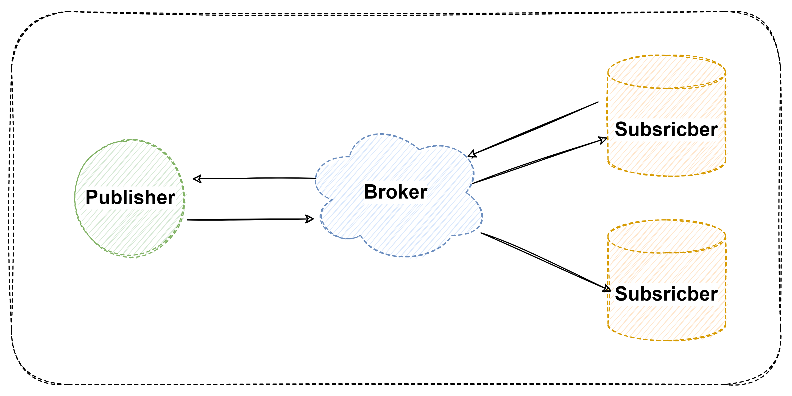

# MQTT

## 1 MQTT协议

​		MQTT是一种基于`发布`与`订阅`模式的轻量级应用层协议，基于TCP/IP协议上实现。它格式简单、规范且易于实现，非常适合物联网场景使用。网络框架图如下面。

​	

## 2 发布&订阅模型

​	`	MQTT`使用的发布/订阅消息模式，它提供了一对多的消息分发机制，从而实现与应用程序的解耦。一种消息传递模式，**消息不是直接从发送器发送到接收器**（即点对点），而是由`MQTT server`（或称为 MQTT Broker）分发的。

核心概念

1.  Broker：MQTT消息的中转站，负责接收来自客户端的消息并将其路由到正确的客户端。
2.  Client：与Broker通信的设备。
3.  Topic：消息的类别，客户端可以发布和订阅特定主题的消息。
4.  Publish：向Broker发布消息的操作。
5.  Subscribe：订阅特定主题的消息的操作。
6.  QoS（Quality of Service）：控制消息传输的服务质量，可以指定消息的可靠性。

## 3 MQTT协议报文格式

### 3.1 控制报文格式

​	MQTT控制报文由三部分组成，分别是固定报头、可变报头、有效载荷（根据需要可选）。

| 字节数        | 域段                | 备注                             |
| ------------- | ------------------- | -------------------------------- |
| **(2~5byte)** | **Fixed header**    | **固定报头，所有控制报文都包含** |
| ...           | **Variable header** | **可变报头， 部分控制报文包含**  |
| ...           | **Payload**         | **有效载荷， 部分控制报文包含**  |

-   **`Fixed header`** , 固定头报文格式

​	  1 `MQTT类型`（bit[7~4]）可表示16个数字，除0、15以为，剩余14个数字各表示一个控制报文类型。

| Reserved    | 0    | 禁止           | 保留                                 |
| ----------- | ---- | -------------- | ------------------------------------ |
| CONNECT     | 1    | 客户端到服务端 | 客户端请求连接服务端                 |
| CONNACK     | 2    | 服务端到客户端 | 连接报文确认                         |
| PUBLISH     | 3    | 两个方向都允许 | 发布消息                             |
| PUBACK      | 4    | 两个方向都允许 | QoS 1 消息发布收到确认               |
| PUBREC      | 5    | 两个方向都允许 | 发布收到（保证交付第一步）           |
| PUBREL      | 6    | 两个方向都允许 | 发布释放（保证交付第二步）           |
| PUBCOMP     | 7    | 两个方向都允许 | QoS 2 消息发布完成（保证交互第三步） |
| SUBSCRIBE   | 8    | 客户端到服务端 | 客户端订阅请求                       |
| SUBACK      | 9    | 服务端到客户端 | 订阅请求报文确认                     |
| UNSUBSCRIBE | 10   | 客户端到服务端 | 客户端取消订阅请求                   |
| UNSUBACK    | 11   | 服务端到客户端 | 取消订阅报文确认                     |
| PINGREQ     | 12   | 客户端到服务端 | 心跳请求                             |
| PINGRESP    | 13   | 服务端到客户端 | 心跳响应                             |
| DISCONNECT  | 14   | 客户端到服务端 | 客户端断开连接                       |
| Reserved    | 15   | 禁止           | 保留                                 |

​	`MQTT标志`（bit [3~0]）要求按照协议规定传固定值，其他按标志位定义的含义决定传值， 标志位表格如图所示。

| 控制报文    | 固定报头标志       | Bit 3 | Bit 2 | Bit 1 | Bit 0   |
| ----------- | ------------------ | ----- | ----- | ----- | ------- |
| CONNECT     | Reserved           | 0     | 0     | 0     | 0       |
| CONNACK     | Reserved           | 0     | 0     | 0     | 0       |
| PUBLISH     | Used in MQTT 3.1.1 | DUP1  | QoS2  | QoS2  | RETAIN3 |
| PUBACK      | Reserved           | 0     | 0     | 0     | 0       |
| PUBREC      | Reserved           | 0     | 0     | 0     | 0       |
| PUBREL      | Reserved           | 0     | 0     | 1     | 0       |
| PUBCOMP     | Reserved           | 0     | 0     | 0     | 0       |
| SUBSCRIBE   | Reserved           | 0     | 0     | 1     | 0       |
| SUBACK      | Reserved           | 0     | 0     | 0     | 0       |
| UNSUBSCRIBE | Reserved           | 0     | 0     | 1     | 0       |
| UNSUBACK    | Reserved           | 0     | 0     | 0     | 0       |
| PINGREQ     | Reserved           | 0     | 0     | 0     | 0       |
| PINGRESP    | Reserved           | 0     | 0     | 0     | 0       |
| DISCONNECT  | Reserved           | 0     | 0     | 0     | 0       |

*注：DUP1=控制报文的重复分发标志 ，QoS2 = PUBLISH 报文的服务质量等级， RETAIN3 = PUBLISH 报文的保留标志。*

​	2 **`剩余长度`**   表示当前报文剩余部分的字节数， 包括可变报头和负载的数据。 不包括用于编码剩余长度字段本身的字节数  。大小为1~4 Byte。 每个字节格式为，低 7 位有效位用于编码数据，最高有效位用于指示是否有更多的字节。 因此每个字节可以编码 128 个数值和一个延续位。

-   **`Variable header`**   它在固定报头和负载之间。可变报头的内容根据报文类型的不同而不同。可变报头的报文标识符（Packet Identifier） 字段存在于在多个类型的报文里 。

    | 控制报文    | 报文标识符字段       |
    | ----------- | -------------------- |
    | CONNECT     | 不需要               |
    | CONNACK     | 不需要               |
    | PUBLISH     | 需要（如果 QoS > 0） |
    | PUBACK      | 需要                 |
    | PUBREC      | 需要                 |
    | PUBREL      | 需要                 |
    | PUBCOMP     | 需要                 |
    | SUBSCRIBE   | 需要                 |
    | SUBACK      | 需要                 |
    | UNSUBSCRIBE | 需要                 |
    | UNSUBACK    | 需要                 |
    | PINGREQ     | 不需要               |
    | PINGRESP    | 不需要               |
    | DISCONNECT  | 不需要               |

-   **`Payload`**  某些 MQTT 控制报文在报文的最后部分包含一个有效载。

| 控制报文    | 有效载荷 |
| ----------- | -------- |
| CONNECT     | 需要     |
| CONNACK     | 不需要   |
| PUBLISH     | 可选     |
| PUBACK      | 不需要   |
| PUBREC      | 不需要   |
| PUBREL      | 不需要   |
| PUBCOMP     | 不需要   |
| SUBSCRIBE   | 需要     |
| SUBACK      | 需要     |
| UNSUBSCRIBE | 需要     |
| UNSUBACK    | 不需要   |
| PINGREQ     | 不需要   |
| PINGRESP    | 不需要   |
| DISCONNECT  | 不需要   |

## 3.2 控制报文类型

## 4 MQTT 实例

​	参考链接： [ ESP32-C3入门教程 网络 篇（三、 MQTT 协议基础介绍及测试](https://blog.csdn.net/weixin_42328389/article/details/123049977)